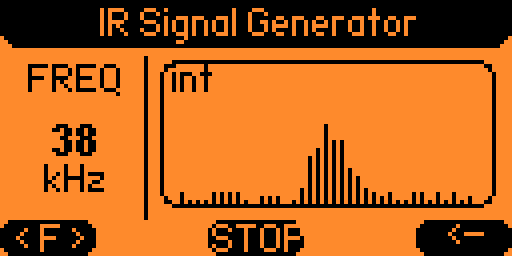

#  IR Signal Generator for Flipper Zero



A professional-grade Infrared Signal Generator for Flipper Zero with an advanced dashboard, real-time spectrum visualization, and automatic external module support.

##  Features / Özellikler

### English
- **Advanced UI:** Sleek, rounded design with a professional header and compact footer.
- **📈 Spectrum Visualization:** Real-time RF-style line spectrum with noise and carrier peak simulation.
- **🔌External IR Support:** Automatic detection of external IR modules via GPIO.
- **⚡ OTG Power:** Automatically enables 5V power for external hardware.
- ** Dynamic LED:** Frequency-reactive LED blinking (Red/Green/Blue/Purple).
- **🕹️ Live Adjust:** Change frequency on-the-fly without stopping the signal.

### Türkçe
- **Gelişmiş Arayüz:** Profesyonel başlık ve kompakt alt bilgi ile şık, oval tasarım.
- **📈 Spektrum Görselleştirme:** Gürültü ve taşıyıcı tepe noktası simülasyonlu gerçek zamanlı RF tarzı spektrum.
- ** Harici IR Desteği:** GPIO üzerinden harici IR modüllerinin otomatik algılanması.
- **⚡ OTG Güç:** Harici donanım için otomatik 5V güç çıkışı.
- **Dinamik LED:** Frekansa duyarlı LED yanıp sönme (Kırmızı/Yeşil/Mavi/Mor).
- **🕹️ Canlı Ayar:** Sinyali durdurmadan anlık frekans değişimi.

---

## 🎮 Controls / Kontroller

| Button / Tuş | Action (EN) | İşlem (TR) |
| :--- | :--- | :--- |
| **OK** | Toggle Signal (TX/STOP) | Sinyali Başlat/Durdur |
| **Left / Right** | Adjust Frequency | Frekansı Ayarla |
| **Back** | Quit Application | Uygulamadan Çık |

---

## 🛠️ Installation / Kurulum

1. Clone or copy this folder to `applications_user/` in your firmware.
2. Run the following command from the firmware root:

```bash
./fbt fap_ir_signal_generator
```

---

## 👨‍💻 Author
Developed by **Sacriphanius**

## ⚖️ License
This project is licensed under the [MIT License](LICENSE).
